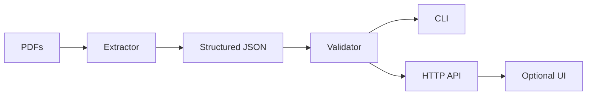

# Invoice QC Service

A small Python service that extracts structured data from invoice PDFs, validates it against business rules, and exposes both a CLI and HTTP API (FastAPI). Bonus hooks for a lightweight UI are sketched.

## Schema & Validation Design

Fields (invoice-level):
- `invoice_number`: string, required identifier
- `external_reference`: string, optional external/PO reference
- `invoice_date`: ISO date string
- `due_date`: ISO date string
- `seller_name`: string
- `seller_address`: string
- `seller_tax_id`: string (e.g., VAT/GST)
- `buyer_name`: string
- `buyer_address`: string
- `buyer_tax_id`: string
- `currency`: ISO 4217 code (e.g., EUR, USD, INR)
- `payment_terms`: string summary (e.g., "Net 30")
- `net_total`: number (pre-tax)
- `tax_amount`: number (tax value)
- `gross_total`: number (net + tax)
- `notes`: free-text notes/footers

Line items:
- `description`: string
- `quantity`: number
- `unit_price`: number
- `line_total`: number
- `tax_rate`: number (percentage, optional)

Validation rules (with rationale):
- Completeness/format:
  - `invoice_number`, `invoice_date`, `seller_name`, `buyer_name` must be present (identification + parties).
  - `invoice_date` must be parseable; `currency` must be one of {EUR, USD, GBP, INR} (avoid garbage codes).
  - `net_total`, `tax_amount`, `gross_total` must be numbers and non-negative.
- Business consistency:
  - `net_total + tax_amount ≈ gross_total` within a small tolerance (math sanity).
  - Sum of `line_total` values ≈ `net_total` when line items exist (table consistency).
  - `due_date` (if present) must be on/after `invoice_date` (reasonable payment window).
- Anomaly/duplicate:
  - Reject duplicates by composite key (`invoice_number`, `seller_name`, `invoice_date`).
  - Flag if totals are zero while line items are non-zero (suspicious mismatch).

## Architecture (planned)



## Project Layout (planned)
- `invoice_qc/`
  - `extractor.py` – pdf → text → structured fields heuristics
  - `validator.py` – rule engine and summary aggregation
  - `cli.py` – CLI commands (extract, validate, full-run)
  - `api.py` – FastAPI app with /health and /validate-json
  - `schemas.py` – Pydantic models for invoices/results
  - `utils.py` – shared helpers (dates, money tolerance)
- `sample_pdfs/` – download provided samples here (ignored in git)
- `frontend/` – minimal HTML console to call the API
- `requirements.txt`
- `README.md`

## How this integrates into a larger system
- Upstream doc-processing can drop PDFs into a watched folder; CLI `full-run` or a scheduled job extracts + validates and emits JSON for downstream systems.
- Another service can call `POST /validate-json` after its own extraction/OCR step to reuse the rule engine.
- Future: put the validator behind a queue (e.g., Azure Storage Queue/SQS) and push results to a dashboard or data warehouse; containerize with a Dockerfile for deployment.

## Video
- TODO: Record 10–20 minute walkthrough and add a public link here.

## Setup
- Python 3.10+
- Create venv and install deps:
  - `python3 -m venv .venv && source .venv/bin/activate`
  - `pip install -r requirements.txt`

**Note:** If you get import errors when starting the API, ensure all dependencies are installed:
```bash
.venv/bin/pip install python-multipart httpx
```

## Usage
- CLI (after `pip install -r requirements.txt`):
  - Extract: `python -m invoice_qc.cli extract --pdf-dir sample_pdfs --output extracted.json`
  - Validate: `python -m invoice_qc.cli validate --input extracted.json --report validation_report.json`
  - Full run: `python -m invoice_qc.cli full-run --pdf-dir sample_pdfs --report validation_report.json`
- API:
  - Run: `uvicorn invoice_qc.api:app --reload`
  - Health: `GET http://localhost:8000/health`
  - Validate JSON: `POST http://localhost:8000/validate-json` with body `[{...invoice...}]`
  - Extract + validate PDFs: `POST http://localhost:8000/extract-and-validate-pdfs` (multipart `files`)
- Frontend (bonus): open `frontend/index.html` in a browser while API runs on localhost:8000; paste JSON or upload PDFs to see results.

## AI Usage Notes
- Tools: GPT-5.1-Codex-Max (Preview) for scaffolding and regex ideas.
- Corrections: Adjusted regex groups for invoice number/date to avoid grabbing labels; kept tolerance-based money checks to reduce false negatives suggested by AI.

## Assumptions & Limitations
- Extraction uses heuristics and common labels; not OCR (assumes text-based PDFs).
- Currency detection via explicit codes or symbols; limited set {EUR, USD, GBP, INR}.
- Tolerances used for floating comparisons (2 cents by default) to reduce false failures.
- Line-item parsing is best-effort and expects lines shaped like `description qty unit_price line_total`.
